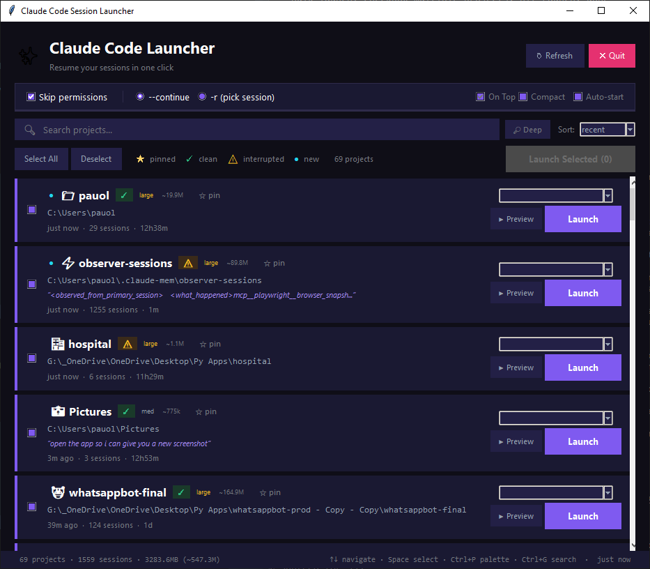

# Claude Code Session Launcher

A lightweight desktop GUI to quickly resume [Claude Code](https://docs.anthropic.com/en/docs/claude-code) sessions after a restart, crash, or context switch.

  

## The Problem

When working with Claude Code across multiple projects, a computer restart means you lose track of which sessions you had open and in which directories. You're left manually browsing `~/.claude/projects/`, mentally mapping encoded folder names back to real paths, and reconstructing the right `claude --continue` commands for each one.

## The Solution

A single-file Python/tkinter app that:

1. **Scans** `~/.claude/projects/` for all Claude Code project folders
2. **Reads** the actual working directory from session JSONL files (no guessing from encoded folder names)
3. **Shows** each project with its real path, last active timestamp, and session count
4. **Launches** Claude Code in a new terminal window with one click

### Features

- **Bulk launch**: checkbox each project, then "Launch Selected" to reopen everything at once
- **Select All / Deselect**: quick bulk selection for the post-restart workflow
- **Search / filter**: type to instantly filter projects by name or path (Ctrl+F)
- **Sort options**: sort by recent activity, name, or session count
- **Session preview popup**: terminal-style popup showing the last conversation (user messages, Claude responses, tool calls)
- **Last message snippet**: see what you were working on right on the card
- **Pin / favorites**: pin projects to always show at top (persisted across restarts)
- **Hide / archive**: right-click to hide stale projects, manage hidden projects from a popup
- **Session health**: **OK** = clean exit, **!!** = interrupted/crashed — know which sessions need attention
- **Auto-start with Windows**: optional checkbox to launch automatically on boot
- **`--continue`** mode: resume the most recent session (default)
- **`-r` mode**: pick a specific session from a dropdown (sorted by recency)
- **`--dangerously-skip-permissions`** toggle (on by default)
- **Launch feedback**: green flash on card stripe confirms your session launched
- **Double-click to launch**: double-click any card to launch immediately
- **Right-click context menu**: launch, pin/unpin, hide, or open folder
- **Keyboard shortcuts**: Ctrl+A select all, Ctrl+F search, Enter launch, Escape clear/deselect, Ctrl+R refresh
- **Minimize-on-close**: X button minimizes to taskbar; dedicated Quit button to exit
- **Background loading**: projects load in a background thread so the UI appears instantly
- **Auto-refresh**: watches `~/.claude/projects/` for changes and refreshes automatically
- **Resizable preview**: popup conversation wraps text dynamically as you resize
- **Path validation**: purple border = path exists, red = missing (disabled), gold = pinned
- **Cross-platform**: Windows Terminal, macOS Terminal.app, Linux (gnome-terminal, konsole, xfce4-terminal)
- Automatically clears the `CLAUDECODE` env var to avoid nested-session errors

## Screenshot



## Installation

### Requirements

- Python 3.8+ (tkinter included with standard Python on Windows)
- [Claude Code](https://docs.anthropic.com/en/docs/claude-code) CLI installed and on PATH

### Setup

```bash
git clone https://github.com/wolverin0/claude-launcher.git
cd claude-launcher
```

**Option A: Double-click**
- Run `claude-launcher.pyw` directly (Python must be associated with `.pyw` files)

**Option B: Desktop shortcut**
- Create a `.bat` file on your desktop:
```bat
@echo off
start "" pythonw "C:\path\to\claude-launcher.pyw"
```

**Option C: From terminal**
```bash
python claude-launcher.pyw
```

No dependencies beyond the Python standard library.

## Keyboard Shortcuts

| Shortcut | Action |
|----------|--------|
| `Ctrl+F` | Focus search bar |
| `Ctrl+A` | Select all projects |
| `Ctrl+R` | Refresh project list |
| `Enter` | Launch selected projects |
| `Escape` | Clear search / deselect all |
| `Double-click` | Launch a single project |
| `Right-click` | Context menu (launch, pin, hide, open folder) |

## How It Works

1. Lists all subdirectories in `~/.claude/projects/`
2. For each project, reads the most recent `.jsonl` session file and extracts the `cwd` field — this is the **real filesystem path** Claude Code was running in
3. Displays projects sorted by last activity (or name/session count)
4. On "Launch", opens a new terminal window in the project directory and runs:
   ```
   set CLAUDECODE= && claude --continue --dangerously-skip-permissions
   ```

### Why read JSONL instead of decoding folder names?

Claude Code encodes project paths by replacing every non-alphanumeric character with `-`. This is a lossy encoding — `Py Apps` (space), `_OneDrive` (underscore), and `my-project` (hyphen) all produce the same `-` character. Rather than attempting to reverse this ambiguous encoding, we read the original path directly from session data.

## Platform Support

| Platform | Terminal | Status |
|----------|----------|--------|
| Windows | Windows Terminal / cmd.exe | Fully tested |
| macOS | Terminal.app | Supported |
| Linux | gnome-terminal, konsole, xfce4-terminal, xterm | Supported |

## License

MIT
